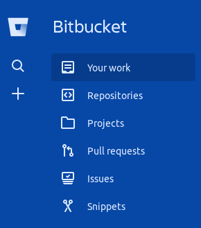
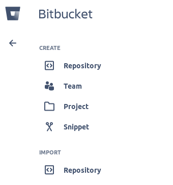
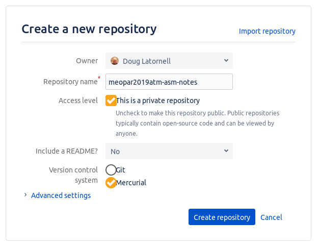

> ## Learning Objectives {.objectives}
>
> * Explain what remote repositories are and why they are useful.
> * Explain how to create a remote repository on Bitbucket.
> * Explain what happens when a remote repository is cloned.
> * Explain what happens when changes are pushed to or pulled from a remote repository.

By now it should be obvious that version control is a powerful tool for organizing our own work on our personal laptop or workstation.
It helps us keep track of what we did when,
gives us the ability to go back in time in our project's history,
and can help us recover from mistakes.
But there's more...

Mercurial allows us to move our work among copies
(clones, actually)
of our repositories on different machines.
We can use that capability to synchronize files and metadata between our laptop and a lab workstation,
or between computers at home and at work,
or between our local computer and an HPC cluster,
etc.
While it is possible to move files and metadata between any two repository copies,
in practice it's easiest to use one copy as a central hub.

The easiest way to set up a copy of a repo as a central hub that we can access from anywhere that we have a network connection is to use a hosting service like [Bitbucket](https://bitbucket.org/).

Let's start by creating a new repository on Bitbucket.

Log in to the Bitbucket site,
then click on the big plus sign ('+') on the left side of the page:

to access the `Create` menu:

In the `Creata a new repository` form at appears,
name your repository something like `meopar2019atm-asm-notes`,
ensure that `Mercurial` is selected as the version control system,
then click the `Create Repository` button:

As soon as the repository is created,
Bitbucket displays a page with a URL and some information on configuring a local repository to connect it to this new repository:

We're going to do the easiest thing:
clone the empty repository from Bitbucket on to our laptops.

Copy the `hg clone` command with the repository URL from the text box at the top of the page.
It looks like:

> `hg clone https://douglatornell@bitbucket.org/douglatornell/meopar2019atm-asm-notes`

but with your Bitbucket user name in it.

At the command-line,
change to your `Desktop` directory (folder),
then paste and execute the `hg clone` command:

~~~ {.bash}
$ cd ~/Desktop
$ hg clone https://douglatornell@bitbucket.org/douglatornell/meopar2019atm-asm-notes
~~~
~~~ {.output}
http authorization required for https://bitbucket.org/douglatornell/meopar2019atm-asm-notes
realm: Bitbucket.org HTTP
user: douglatornell
password:
destination directory: meopar2019atm-asm-notes
no changes found
updating to branch default
0 files updated, 0 files merged, 0 files removed, 0 files unresolved
~~~

In TortoiseHg,
select the `File > Clone Repository...` menu item to open the `Clone` dialog.
Paste the URL part of the `hg clone` command that you copied from Bitbucket into the `Source:` textbox.
Use the `Browse` button beside the `Destination:` textbox to navigate to your `Desktop` directory (folder).
Confirm that the source URL,
destination path,
and the `hg clone` command that TortoiseHg has constructed from them look correct,
then click the `Clone` button.

> ## How are Local and Remote Repositories Linked? {.callout}
>
> As part of the cloning process,
> Mercurial records the URL that the local repository was cloned from as a `path` called `default` in the `[paths]` section
> of the repository configuration file `.hg/hgrc`.
>
> You can inspect it with the `hg paths` command.
>
> If you want to edit the `default` path,
> you can open `.hg/hgrc` in an editor with the `hg config --local` command.
> That is how you could connect a repository like `forecast` that already exists on your laptop to a new,
> empty `forecast` repository that you create on Bitbucket.

We interact with remote repositories with 2 pairs of commands.
To find out what's going to happen:

* `hg incoming` (or shortened to `hg in`) to see an `hg log`-like list of changesets that are in the remote repository but not in our local clone
* `hg outgoing` (or `hg out` for short) to see a list of changesets committed to out local repository but not yet in the remote repository

and to make things happen:

* `hg pull` to pull changesets from the remote repository into our local clone
* `hg push` to push changesets from our local clone to the remote repository

TortoiseHg has icons for those operations on the right end of its icon bar,
and they are available in the menus under `Repository > Synchronize`.

After you do an `hg pull` the changeset(s) exist in the local `.hg` but they aren't yet applied to your working files.
To do that,
use the `hg update` command.
You can combine pulling and updating with `hg pull --update` or `hg pull -u`.

If you try those commands out now,
the results are fairly boring because our new remote repository and our new local clone of it are identical at the moment.
Let's make things more interesting...

> ## MEOPAR ATM-ASM Repository {.challenge}
>
> * Create a `notes.txt` file in your local `meopar2019atm-asm-notes` repository
> * Add some notes about things you have learned,
>   or people you have met and their research
> * Do at least 1 `hg commit` (more if you want to practice)
> * Do an `hg outgoing` to see the changesets that are ready to be pushed to Bitbucket
> * Push your changesets to Bitbucket
> * On Bitbucket in your browser,
>   navigate to your `notes.txt` file in the `Source` section
> * Use the Bitbucket editor to add another note to your file and commit it
> * Got back to your local repository and do an `hg incoming` to see the changeset that can be pulled from Bitbucket
> * Pull the changeset in from Bitbucket
> * Do an `hg update` to make the new changeset part of your working copy

> ## Bitbucket Timestamp {.challenge}
>
> Look at the **timestamp** of a changeset that you pushed to Bitbucket.
> How does Bitbucket record times, and why?

> ## Learning Objectives {.objectives}
>
> * Explain what remote repositories are and why they are useful.
> * Explain how to create a remote repository on Bitbucket.
> * Explain what happens when a remote repository is cloned.
> * Explain what happens when changes are pushed to or pulled from a remote repository.
