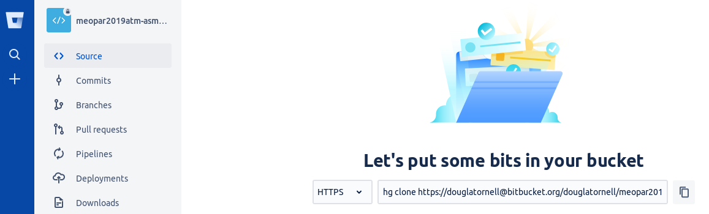

> ## Learning Objectives {.objectives}
>
> * Explain what remote repositories are and why they are useful.
> * Explain how to create a remote repository on Bitbucket.
> * Explain what happens when a remote repository is cloned.
> * Explain what happens when changes are pushed to or pulled from a remote repository.

By now it should be obvious that version control is a powerful tool for organizing our own work on our personal laptop or workstation.
It helps us keep track of what we did when,
gives us the ability to go back in time in our preoject's history,
and can help us recover from mistakes.
But there's more...

Mercurial allows us to move our work among copies
(clones, actually)
of our repositories on different machines.
We can use that capability to synchronize files and metadata between our laptop and a lab workstation,
or between computers at home and at work,
or between our local computer and an HPC cluster,
etc.
While it is possible to move files and metadata between any two repository copies,
in practice it's easiest to use one copy as a central hub.

The easiest way to set up a copy of a repo as a central hub that we can access from anywhere that we have a network connection is to use a hosting service like [Bitbucket](https://bitbucket.org/).

Let's start by creating a new repository on Bitbucket.

Log in to the Bitbucket site,
then click on the big plus sign ('+') on the left side of the page:

to access the `Create` menu:

In the `Creata a new repository` form at appears,
name your repository something like `meopar2019atm-asm-notes`,
ensure that `Mercurial` is selected as the version control system,
then click the `Create Repository` button:

As soon as the repository is created,
Bitbucket displays a page with a URL and some information on configuring a local repository to connect it to this new repository:

We're going to do the easiest thing:
clone the empty repository from Bitbucket on to our laptops.

Copy the `hg clone` command with the repository URL from the text box at the top of the page.
It looks like:

> `hg clone https://douglatornell@bitbucket.org/douglatornell/meopar2019atm-asm-notes`

but with your Bitbucket user name in it.

At the command-line,
change to your `Desktop` directory (folder),
then paste and execute the `hg clone` command:

~~~ {.bash}
$ cd ~/Desktop
$ hg clone https://douglatornell@bitbucket.org/douglatornell/meopar2019atm-asm-notes
~~~
~~~ {.output}
http authorization required for https://bitbucket.org/douglatornell/meopar2019atm-asm-notes
realm: Bitbucket.org HTTP
user: douglatornell
password:
destination directory: meopar2019atm-asm-notes
no changes found
updating to branch default
0 files updated, 0 files merged, 0 files removed, 0 files unresolved
~~~

In TortoiseHg,
select the `File > Clone Repository...` menu item to open the `Clone` dialog.
Paste the URL part of the `hg clone` command that you copied from Bitbucket into the `Source:` textbox.
Use the `Browse` button beside the `Destination:` textbox to navigate to your `Desktop` directory (folder).
Confirm that the source URL,
destination path,
and the `hg clone` command that TortoiseHg has constructed from them look correct,
then click the `Clone` button.

> ## How are Local and Remote Repositories Linked? {.callout}
>
> As part of the cloning process,
> Mercurial records the URL that the local repository was cloned from as a `path` called `default` in the `[paths]` section
> of the repository configuration file `.hg/hgrc`.
>
> You can inspect it with the `hg paths` command.
>
> If you want to edit the `default` path,
> you can open `.hg/hgrc` in an editor with the `hg config --local` command.
> That is how you could connect a repository like `forecast` that already exists on your laptop to a new,
> empty `forecast` repository that you create on Bitbucket.

Select `I have an existing project`,
and use the commands shown to "push" the files and metadata from your local `forecast` repo to the newly created one on Bitbucket:

~~~ {.bash}
$ cd forecast
$ hg push https://bitbucket.org/susan/forecast
~~~

The output from that `hg push` command should look like:

~~~ {.output}
pushing to https://bitbucket.org/susan/forecast
searching for changes
http authorization required for https://bitbucket.org/susan/forecast
realm: Bitbucket.org HTTP
user: douglatornell
password:
remote: adding changesets
remote: adding manifests
remote: adding file changes
remote: added 3 changesets with 3 changes to 1 files
~~~

You will have to type your own Bitbucket user name and password.

The `hg push` command brought the repository on Bitbucket's server up-to-date with the one on our own machine.
Our local and remote repositories are now in this state:

The next step is to connect the two repositories so that we don't have to type the URL every time we do something with Bitbucket.
We do this by making the Bitbucket repository a **remote** for the local repository.
You'll need the URL for the Bitbucket repository,
which is the same URL from the `hg push` statement above.

Use the command:

~~~ {.bash}
$ hg config --local
~~~

to open your local repository's configuration file in your editor.
You should see a template file that looks like:

~~~
# example repository config (see "hg help config" for more info)
[paths]
# path aliases to other clones of this repo in URLs or filesystem paths
# (see "hg help config.paths" for more info)
#
# default      = http://example.com/hg/example-repo
# default-push = ssh://jdoe@example.net/hg/jdoes-fork
# my-fork      = ssh://jdoe@example.net/hg/jdoes-fork
# my-clone     = /home/jdoe/jdoes-clone

[ui]
# name and email (local to this repository, optional), e.g.
# username = Jane Doe <jdoe@example.com>
~~~

Edit the file so that it has just 2 lines:

~~~
[paths]
default = https://bitbucket.org/susan/forecast
~~~

Make sure to use the URL with your Bitbucket username in it rather than `susan`
(the one from the `hg push` command above).

Save the file.
It will automatically be stored in `forecast/.hg/hgrc`.

We can check that the command has worked by running `hg paths`:

~~~ {.bash}
$ hg paths
~~~
~~~ {.output}
default = https://bitbucket.org/susan/forecast
~~~

Now that the default path is set up, we won't need to specify the
target URL when we run `hg push` in the future; running `hg push`
will automatically push the changes from our local repository
to the repository on Bitbucket:

~~~ {.bash}
$ hg push
~~~
~~~ {.output}
pushing to https://bitbucket.org/susan/forecast
searching for changes
no changes found
~~~

This push has no effect because the two repositories are already synchronized.

We can pull changes from the remote repository to the local one as well:

~~~ {.bash}
$ hg pull
~~~
~~~ {.output}
pulling from https://bitbucket.org/susan/forecast
searching for changes
no changes found
~~~

Pulling also has no effect in this case because the two repositories are already synchronized.
If we had pushed some changes to the repository on Bitbucket from a clone on another machine,
though,
this command would download them to our local repository.

> ## Learning Objectives {.objectives}
>
> * Explain what remote repositories are and why they are useful.
> * Explain how to create a remote repository on Bitbucket.
> * Explain what happens when a remote repository is cloned.
> * Explain what happens when changes are pushed to or pulled from a remote repository.

> ## Bitbucket Timestamp {.challenge}
>
> Create a repository on Bitbucket,
> clone it,
> add a file,
> push those changes to Bitbucket.
> Look at the **timestamp** of the change on Bitbucket.
> How does Bitbucket record times, and why?
